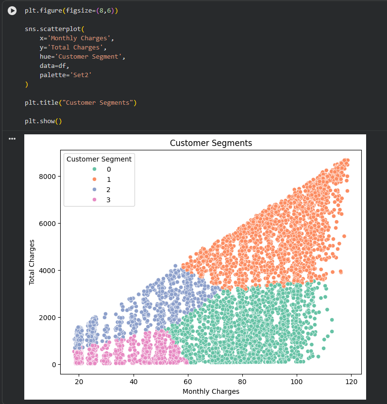
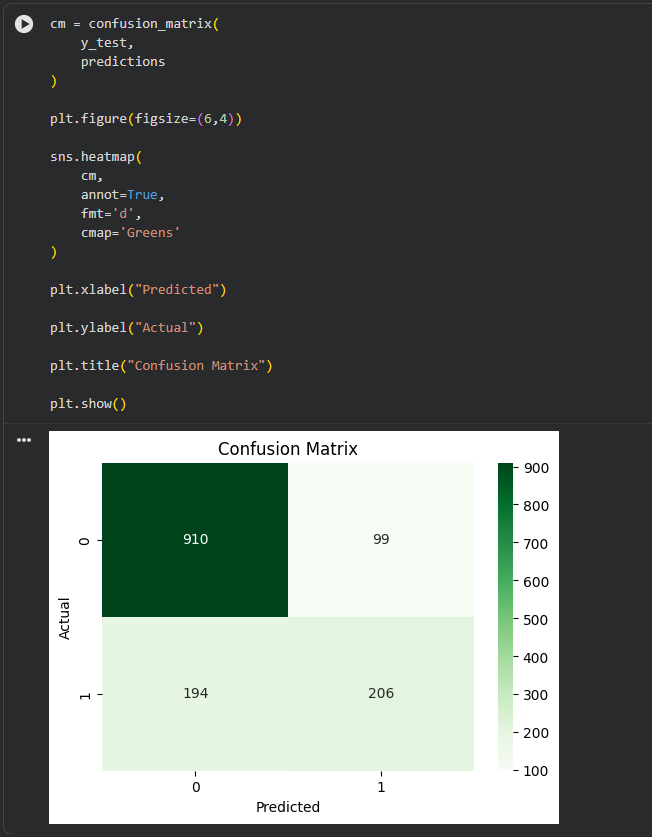
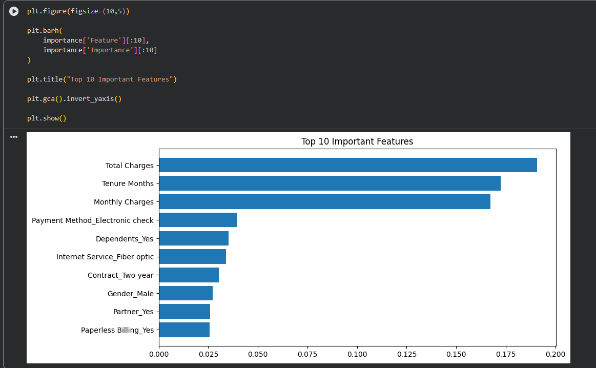

# Customer Segmentation and Churn Prediction using Machine Learning

## Project Overview

Customer retention is one of the biggest challenges for telecommunication companies. This project analyzes customer data to identify different customer groups using **K-Means Clustering** and predicts whether a customer is likely to leave the company using a **Random Forest Classifier**.

The project demonstrates both **unsupervised learning** (Customer Segmentation) and **supervised learning** (Churn Prediction).

---

# Project Objectives

* Analyze customer data
* Perform data preprocessing
* Segment customers into different groups
* Predict customer churn
* Evaluate model performance
* Provide business recommendations

---

# Technologies Used

* Python
* Pandas
* NumPy
* Matplotlib
* Seaborn
* Scikit-learn
* Google Colab

---

# Dataset

**Dataset:** IBM Telco Customer Churn Dataset

The dataset contains customer demographic information, subscription details, billing information, and churn status.

---

# Project Workflow

Dataset Collection

↓

Data Cleaning

↓

Exploratory Data Analysis (EDA)

↓

Customer Segmentation (K-Means)

↓

Customer Churn Prediction (Random Forest)

↓

Model Evaluation

↓

Business Insights

---

# Exploratory Data Analysis

The following visualizations were created:

* Customer Churn Distribution
* Customer Tenure Distribution
* Monthly Charges Analysis
* Contract Type vs Churn
* Payment Method Distribution
* Correlation Heatmap

---

# Customer Segmentation

K-Means Clustering was applied using:

* Tenure Months
* Monthly Charges
* Total Charges

The algorithm grouped customers into different segments based on similar behavior.

---

# Churn Prediction

Algorithm Used:

* Random Forest Classifier

The model predicts whether a customer is likely to churn based on customer information.

---

# Model Performance

**Accuracy:** **79.21%**

Evaluation Metrics:

* Accuracy Score
* Classification Report
* Confusion Matrix
* Feature Importance

---

# Project Output

## Customer Segmentation

---

## Confusion Matrix

---

## Feature Importance

---

# Business Insights

* Customers with month-to-month contracts have a higher churn rate.
* Customers with longer tenure are more likely to stay with the company.
* Monthly Charges and Total Charges are among the most influential features.
* Customer segmentation helps businesses target different customer groups more effectively.

---

# Future Scope

* Improve prediction accuracy using advanced machine learning models.
* Deploy the model using Streamlit or Flask.
* Integrate real-time customer data.
* Build an interactive dashboard for business users.

---

# How to Run

1. Clone this repository.
2. Open the notebook in Google Colab or Jupyter Notebook.
3. Install the required Python libraries.
4. Run all notebook cells sequentially.

---

# Author

**Soham Mahure**

Information Technology Student

Walchand College of Engineering, Sangli
